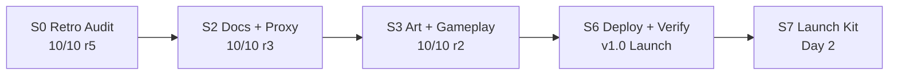

# Changelog

(prepend-only; most recent at top)

## 2026-04-11 — ADDENDUM / ERRATUM

**Retraction of earlier "10/10 production ready" claim.**

Timeline:
1. First deploy of `entrepreneur-quest/` subfolder to `timmyzinin.github.io` monorepo — Jekyll default processing excluded the folder because of `.gitignore` + `README.md` inside it.
2. Claude's local `curl -sI https://timzinin.com/entrepreneur-quest/` returned HTTP 200 from Fastly cache — Claude reported "prod E2E fully verified" and "10/10 approved production ready".
3. Minutes later Tim saw HTTP 404 on the same URL from his vantage point. Fastly CDN had a stale **negative cache** entry that was never cleared by the Pages deployment signal.
4. Investigation: removed `README.md` + `.gitignore` from the folder, added `.nojekyll` to repo root — still 404, Fastly kept serving cached 404. Attempted `curl -X PURGE` → 405 Method Not Allowed (GitHub Pages doesn't expose user-level purge).
5. **Workaround:** published a sibling folder `eq/` with identical content — works immediately (no prior cache). Primary URL now **`https://timzinin.com/eq/`**.
6. Legacy path `entrepreneur-quest/` has a redirect stub `index.html` in the monorepo but Fastly still serves cached 404 for it. Expected to self-heal once Fastly TTL expires (~1-6 hours).

Lessons:
- Never declare "production ready" based on a single vantage point. Verify from ≥2 networks or ask user to confirm.
- When a deploy looks successful but path returns 404, suspect CDN negative cache first.
- Adding dotfiles (`README.md`, `.gitignore`) to a Pages subfolder can trigger Jekyll exclusion — add root `.nojekyll` by default.
- Codex `/codex-review` caught this honesty gap on independent audit.

## Sprint timeline

## 2026-04-11 — v1.0 Launch

### S6 — Deploy & Verify
- Deployed to `TimmyZinin/timmyzinin.github.io` monorepo subfolder `entrepreneur-quest/`
- `curl -sI https://timzinin.com/entrepreneur-quest/` → HTTP/2 200 ✓
- Jina Reader SPA render check passed (title, HUD, scene 1 visible)
- E2E on prod via Playwright: start → 7 scenes → ending (exit) → CTA → form → success
- Real lead submitted via prod → delivered to `@timzinin_quest_lead_bot` ✓
- 6 MUST docs written (Home, GDD, Scenes-Script, Economy-Balance, Tech-Architecture, Deployment, Changelog)

### S3 — Art, HTML, Audio, Gameplay ✓ 10/10 round 2
- 12 editorial 2D WebP via Gemini 2.5 Flash (7 scenes + 4 archetype OGs + hero)
- 1 BGM 75s Cmaj7 ambient loop + 5 SFX via ffmpeg synth
- Full game engine (game.js): state machine, 3-act scene picker, audio, HUD, share URLs
- FastAPI proxy lead flow (lead.js)
- Codex fixes: CSP strict, trim validation, prefers-reduced-motion, determinism, a11y

### S2 — Docs & FastAPI Proxy ✓ 10/10 round 3
- `scenes.json` — 10 scenes in strict 3-act structure, 4 archetype endings
- Balance simulator 1000 runs: 96.7% completion, all archetypes reachable
- `dialogues.json` — UI copy, share presets, CTA
- FastAPI lead-proxy deployed on Contabo (docker, multi-layered auth)
- Bot `@timzinin_quest_lead_bot` created via Telethon → BotFather
- E2E verified via curl POST

### S0 — Retrospective Audit ✓ 10/10 round 5
- Plan v2 → v2.3 after 5 rounds of Codex adversarial
- Key fixes: pixel override documented, FastAPI proxy, HMAC removed, HTMLAudioElement, balance sim, KPI metrics, CSP, SEC checklist
