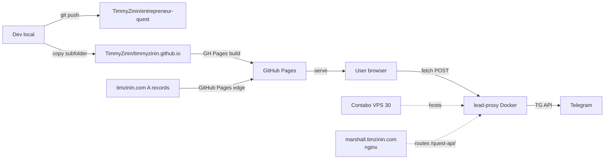

# Deployment

## Infrastructure



## Primary domain DNS

- `timzinin.com` → GitHub Pages (A records to GH Pages edge)
- Root repo: `TimmyZinin/timmyzinin.github.io`
- Subfolder: `entrepreneur-quest/` → served at `https://timzinin.com/entrepreneur-quest/`

## FastAPI proxy deploy (Contabo VPS 30)

```bash
ssh <contabo-host>
cd /opt/lead-proxy
# edit .env — LEADGAME_BOT_TOKEN, LEAD_CHAT_ID
docker compose up -d --build
curl http://127.0.0.1:8090/health  # → {"ok":true,"service":"lead-proxy"}
```

Nginx location in `/etc/nginx/sites-enabled/marshall`:

```nginx
location ^~ /quest-api/ {
    proxy_pass http://127.0.0.1:8090/;
    proxy_set_header Host $host;
    proxy_set_header X-Real-IP $remote_addr;
    proxy_set_header X-Forwarded-For $proxy_add_x_forwarded_for;
    proxy_set_header X-Forwarded-Proto $scheme;
    proxy_set_header Origin $http_origin;
}
```

Reload: `nginx -t && systemctl reload nginx`.

## Verification commands

```bash
# Page 200
curl -sI https://timzinin.com/entrepreneur-quest/
# → HTTP/2 200 server: GitHub.com

# SPA render check
curl -s https://r.jina.ai/https://timzinin.com/entrepreneur-quest/
# → should contain "Год Марины" + scene 1 content

# Assets
curl -sI https://timzinin.com/entrepreneur-quest/data/scenes.json
curl -sI https://timzinin.com/entrepreneur-quest/audio/bgm.mp3
curl -sI https://timzinin.com/entrepreneur-quest/img/hero.webp
# → all HTTP/2 200

# Proxy health
curl -s https://marshall.timzinin.com/quest-api/health
# → {"ok":true,"service":"lead-proxy"}

# E2E lead test
TS=$(($(date +%s) * 1000 - 35000))
curl -s -X POST https://marshall.timzinin.com/quest-api/lead \
  -H "Content-Type: application/json" \
  -H "Origin: https://timzinin.com" \
  -d "{\"name\":\"Test\",\"handle\":\"@test\",\"pain\":\"qa\",\"archetype\":\"exit\",\"session_started_at\":$TS,\"website\":\"\"}"
# → {"ok":true}
```

## Rollback

- **Frontend:** `git revert` in `TimmyZinin/timmyzinin.github.io`, push → Pages auto-rebuilds
- **Backend:** `docker compose down` on Contabo → game falls back to error state ("сервер не отвечает, пиши @timzinin напрямую")
- **Token rotation:** `@BotFather → /revoke` → new token to `.env` → `docker compose up -d --force-recreate`

## Monitoring

- **Uptime:** `curl -sI` cron on Contabo (existing general infrastructure check)
- **Umami dashboard:** `https://umami.timzinin.com/` — events `game_start`, `ending`, `lead_submitted`
- **Lead stream:** bot @timzinin_quest_lead_bot chat with Tim (private)
