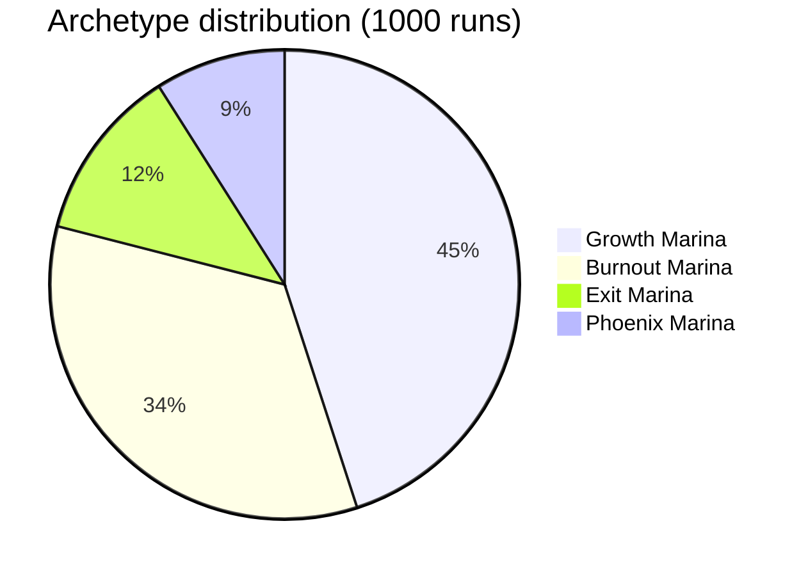
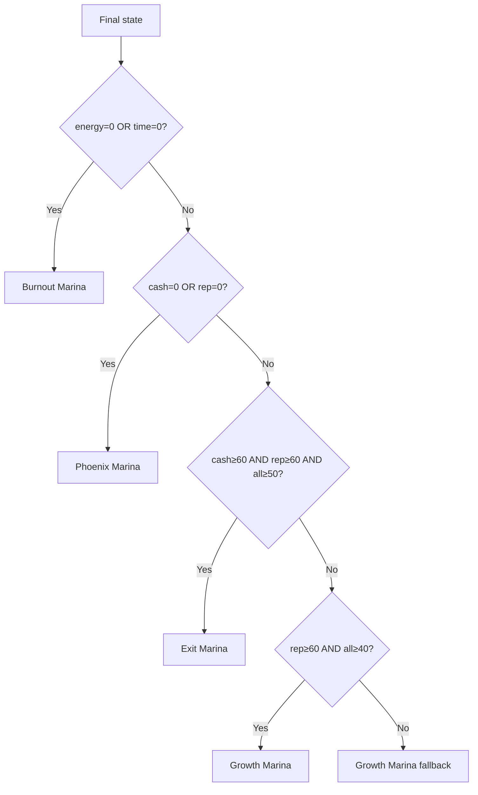

# Economy Balance

## Simulation targets (all met)

| Metric | Target | Actual |
|---|---|---|
| Completion rate (7/7 scenes) | ≥70% | **96.7%** ✓ |
| Early game over (<scene 4) | ≤15% | **0.0%** ✓ |
| Avg scenes reached | 6.0-7.0 | **6.95** ✓ |
| Archetype reachability (each ≥5%) | all | Exit 12.1% / Growth 44.8% / Burnout 33.5% / Phoenix 9.6% ✓ |

Simulator: `tools/simulate.js` — 1000 random playthroughs with ±3 noise on every delta.

## Archetype distribution

## Resource deltas by scene × choice

### Act I

| Scene | Choice | Energy | Cash | Time | Rep |
|---|---|---|---|---|---|
| s01 kitchen | A hand | -10 | 0 | -10 | 0 |
| s01 kitchen | **B Claude** | +10 | +5 | +5 | +5 |
| s02 editor | A HR | -5 | -15 | -10 | 0 |
| s02 editor | **B Claude Code** | +5 | +10 | +5 | +10 |

### Act II (shuffle pool)

| Scene | Choice | Energy | Cash | Time | Rep |
|---|---|---|---|---|---|
| s03 seo | A freelance | 0 | -20 | 0 | 0 |
| s03 seo | **B API** | +5 | +5 | +5 | +15 |
| s04 deck | A self | -15 | 0 | -10 | +5 |
| s04 deck | **B Projects** | +5 | +15 | 0 | +15 |
| s05 twitter | A emotional | -10 | 0 | -5 | -15 |
| s05 twitter | **B Claude** | +10 | 0 | 0 | +15 |
| s08 nda | A blame | -5 | 0 | -5 | -15 |
| s08 nda | **B honest** | +5 | 0 | 0 | +15 |
| s09 locale | A refuse | 0 | -10 | +5 | -15 |
| s09 locale | **B API** | 0 | +15 | 0 | +20 |
| s10 report | A night | -15 | 0 | -10 | 0 |
| s10 report | **B Projects** | +10 | 0 | +10 | +10 |

### Act III

| Scene | Choice | Energy | Cash | Time | Rep |
|---|---|---|---|---|---|
| s06 4-day | A no | -10 | +5 | +10 | -20 |
| s06 4-day | **B yes+CC** | +15 | +10 | 0 | +20 |
| s07 conf | A pass | 0 | 0 | +5 | -15 |
| s07 conf | **B demo** | -5 | +10 | -5 | +30 |

## Ending triggers (evaluation order)

## Tuning history

| Loop | Change | Result |
|---|---|---|
| #0 baseline | Initial pessimistic deltas | 47.9% completion, 89% burnout |
| #1 Energy-rescue | B choices now restore energy (Claude helps) | 96% completion, but exit 0% |
| #2 Cash rebalance | Raised cash in B + lowered exit threshold to 60 | **96.7% completion, all archetypes reachable** ✓ |
