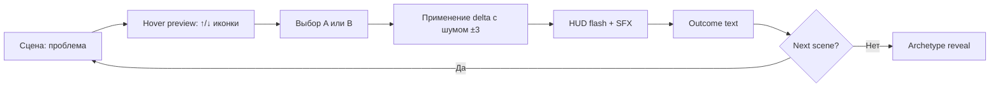

# Game Design Document

## Pitch

One-sentence: *Интерактивная история про один год из жизни Марины — предпринимателя — где каждый выбор меняет 4 ресурса и ведёт к одной из 4 концовок-архетипов.*

## Hero

**Марина, 34**, владелица контент-студии "Долгий путь" (7 человек, Москва). Бывший продюсер. Работает 12 часов в день. Студия растёт, но каждую неделю новый кризис.

**Crack line** (сцена 1): *"Ты любой из нас. Просто твоё имя сегодня — Марина."*

## Core loop (30 seconds)

## 3-act structure

| Act | Scenes | Tone |
|---|---|---|
| **I Setup** | s01 (fixed) + s02 | Ироничный — "обычный понедельник", знакомство с Мариной |
| **II Escalation** | 3 shuffled из act=2 pool (s03, s04, s05, s08, s09, s10) | Нарастающая драма — клиенты, инвестор, конкурент, репутация |
| **III Climax + Epilogue** | s06 (fixed penultimate) + s07 (fixed last) | Моральная дилемма + пик |

Total: 2 + 3 + 2 = **7 scenes**. Shuffle pool 10, fixed 3 (s01, s06, s07).

## Resources (4, Reigns-style)

| Resource | Start | Game over | Primary? |
|---|---|---|---|
| **Энергия** ⚡ | 50 | 0 (выгорание) | **Yes** — primary, 1.5× size, pulsing HUD |
| Деньги ₽ | 50 | 0 (банкротство) | No |
| Время ⏳ | 50 | 0 (сорваны сроки) | No |
| Репутация ★ | 50 | 0 (скандал) | No |

Clamp [0, 100]. Noise ±3 per delta. Every choice modifies 2-3 resources.

## Endings (4 archetypes)

| # | Name | Trigger | Frequency (sim) |
|---|---|---|---|
| 1 | **Exit Marina** | cash≥60 AND rep≥60 AND all≥50 | ~12% |
| 2 | **Growth Marina** | rep≥60 AND all≥40 | ~45% |
| 3 | **Burnout Marina** | energy=0 OR time=0 | ~34% |
| 4 | **Phoenix Marina** | cash=0 OR rep=0 | ~9% |

All endings → same CTA ("Получи свой персональный план") with different emotional framing per archetype.

## Player motivation

- **Clarity of goal**: 15-sec exposition tooltip on scene 1
- **Preview of choice**: hover/touch shows up/down icons (no numbers — intuitive)
- **Immediate feedback**: HUD flash + SFX + delta chip on outcome
- **Narrative pull**: Italic internal monologue between scenes
- **Shareable reveal**: archetype = shareable identity ("Я получил Burnout")

## Out of scope (day 1)

- Character portraits (consistency risk with Gemini)
- Adaptive BGM layering (single loop sufficient)
- VO narration
- Multi-language (RU only)
- Save slot (sessionStorage only)
