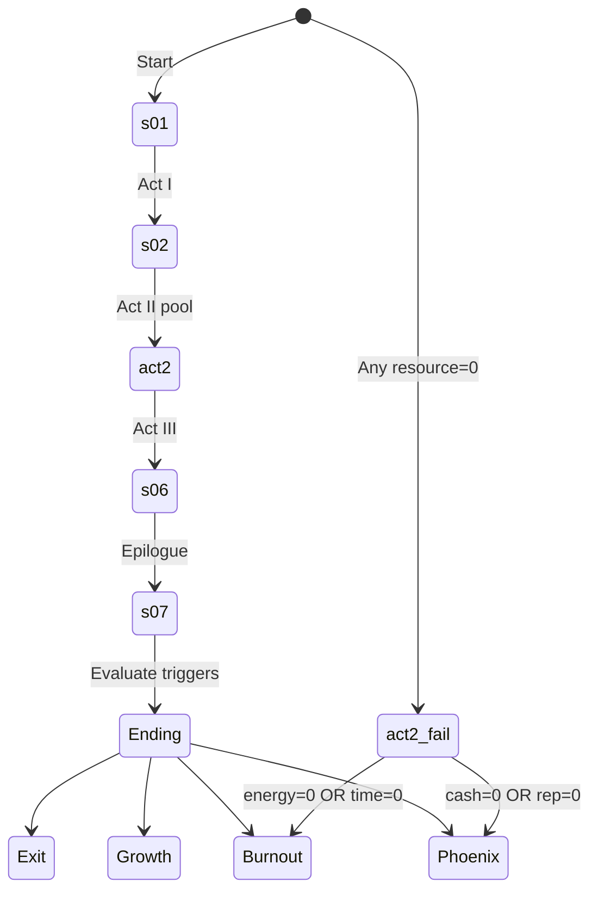

# Scenes Script

Full text of 10 scenes (7 shown per playthrough) + 4 archetype endings.
Source of truth: `data/scenes.json` and `data/dialogues.json`.

## Scene transitions

## Act I

### s01 — Утро, кухня (fixed first)

**Intro:** Понедельник. Кофе остыл, пока ты считала почту. Сорок семь писем. Три клиента — в огне. Встреча через час.

**Internal:** Ты любой из нас. Просто твоё имя сегодня — Марина.

**Choices:**
- A: "Тащить руками. Я сильная" → -10 energy, -10 time
- B: "Посадить Claude на триаж" → +10 energy, +5 time, +5 rep, +5 cash

### s02 — Офис, редактор увольняется

**Intro:** Редактор вошла с лицом. "Марин, мне надо поговорить". Клиент бесится — дедлайн в понедельник.

**Choices:**
- A: "Срочно искать замену через HR" → -15 cash, -10 time, -5 energy
- B: "Собрать внутренний tool через Claude Code" → +10 cash, +5 time, +10 rep, +5 energy

## Act II (3 из 6 shuffled)

### s03 — Экран компьютера, SEO-ресёрч
- A: "Отдать фрилансерам" → -20 cash
- B: "Batch через Claude API" → +5 cash, +5 time, +15 rep, +5 energy

### s04 — Переговорная, pitch deck
- A: "Рисовать самой ночами" → -10 time, +5 rep, -15 energy
- B: "Собрать через Claude Projects" → +15 cash, +15 rep, +5 energy

### s05 — Twitter троллящий тред
- A: "Отвечать эмоционально" → -5 time, -15 rep, -10 energy
- B: "Дать Claude модерировать ответ" → +15 rep, +10 energy

### s08 — NDA утечка
- A: "Оправдываться, свалить на редактора" → -5 time, -15 rep, -5 energy
- B: "Честный ответ + Claude структурирует" → +15 rep, +5 energy

### s09 — Срочная локализация
- A: "Отказать — невозможно" → -10 cash, +5 time, -15 rep
- B: "Claude API батч-перевод + ручная вычитка" → +15 cash, +20 rep

### s10 — Отчёт за месяц
- A: "Взять ночь на это" → -10 time, -15 energy
- B: "Claude Projects с шаблоном" → +10 time, +10 rep, +10 energy

## Act III

### s06 — Slack, 4-day week request (fixed penultimate)
- A: "Нет. У нас дедлайны" → +5 cash, +10 time, -20 rep, -10 energy
- B: "Да + Claude Code оптимизация workflow" → +10 cash, +20 rep, +15 energy

### s07 — Конференция (fixed last)
- A: "Слишком занята" → +5 time, -15 rep
- B: "Готовиться, live demo через Claude Code" → +10 cash, -5 time, +30 rep, -5 energy

## Endings

### Exit Marina (cash≥60 AND rep≥60 AND all≥50)

**Title:** Ты вышла на автопилот

**Narrative:** Через год студия работает без твоего ежедневного участия. Команда любит то что делает. Клиенты приходят по рекомендациям. Ты впервые за три года поехала в отпуск на две недели — и студия не рухнула.

**CTA:** Ты дошла сюда — значит готова к следующему уровню. Хочешь построить так же? Запишись на разговор с Тимом.

### Growth Marina (rep≥60 AND all≥40)

**Title:** Устойчивый рост

**Narrative:** Команда счастлива. Клиенты возвращаются. Ты вышла на ритм — 3 больших проекта в квартал, retainer-базу, свободные выходные. Не exit, но стабильность.

**CTA:** Хочешь ускорить рост и выстроить масштабируемую операционку? Тим знает как.

### Burnout Marina (energy=0 OR time=0)

**Title:** Выгорание

**Narrative:** Полгода на диване. Врачи говорят "это было предсказуемо". Клиенты тебя помнят с добрым словом, но проектов у тебя уже нет. Студия закрылась тихо.

**CTA:** Не повторяй путь Марины. Поговори с Тимом до того, как выгоришь — один разговор может всё изменить.

### Phoenix Marina (cash=0 OR rep=0)

**Title:** Бизнес сгорел

**Narrative:** Счета пусты. Клиенты ушли. Студия закрылась. Но через три месяца ты пишешь первый post-mortem в блоге — и он вирусится. Тебя зовут консультантом в другие студии. Ты заново.

**CTA:** Начинаешь заново? Один разговор с Тимом может изменить траекторию следующего раза.
