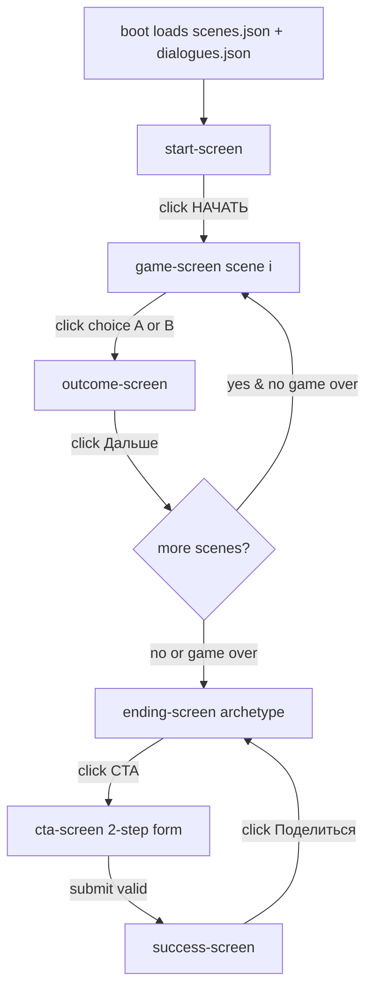
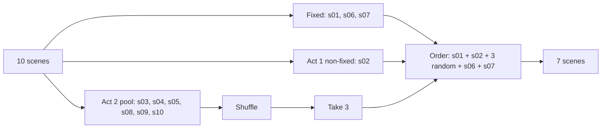
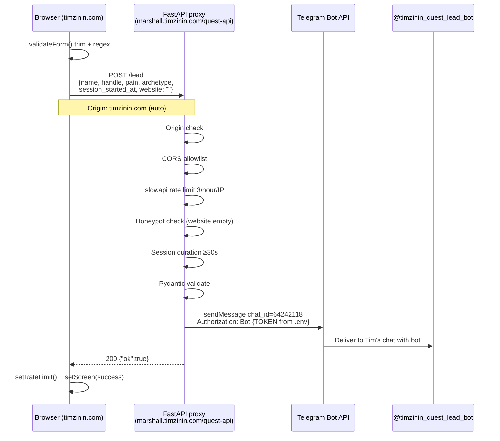
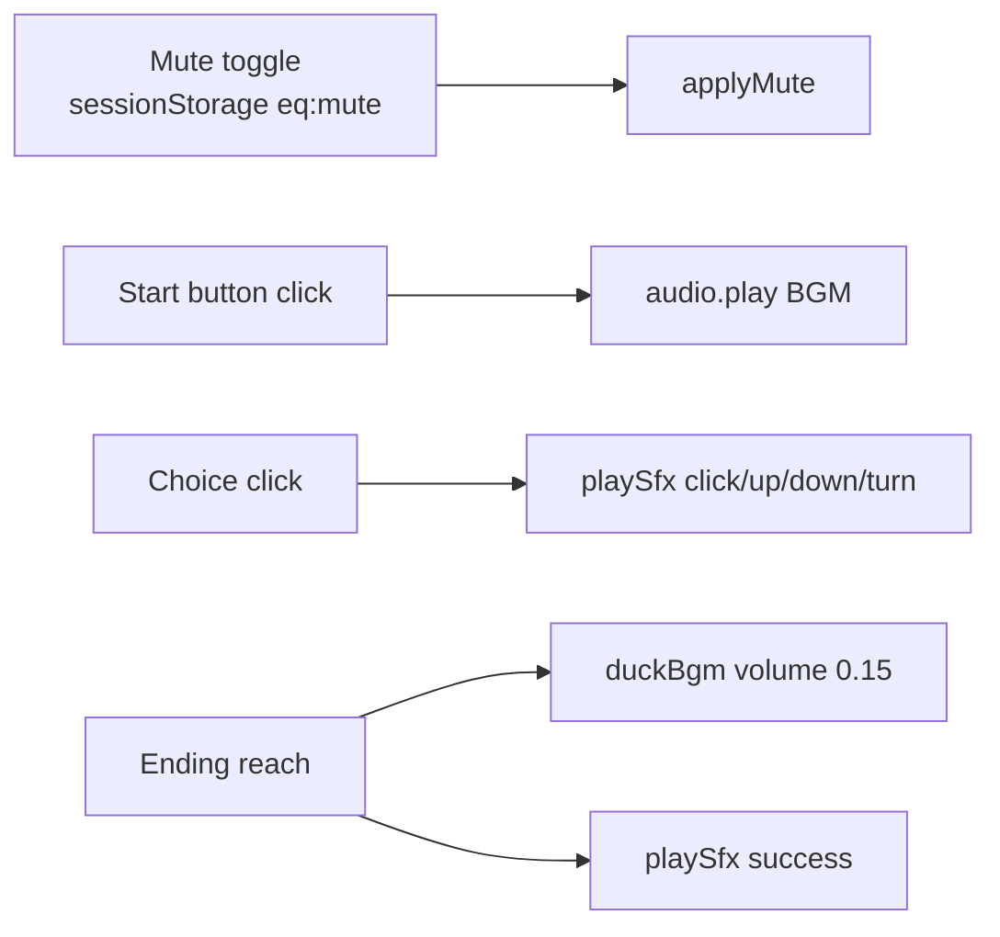

# Tech Architecture

## Client-only stack

- **Language:** Vanilla JS + DOM + CSS (zero dependencies, ~25KB bundled)
- **Rendering:** `<div>` background-image per scene, CSS transforms for parallax, SVG noise grain overlay (data-URI)
- **Fonts:** Google Fonts — Instrument Serif Italic + Space Grotesk
- **Audio:** HTMLAudioElement only (not Web Audio API, better TG WebView compatibility)
- **State persistence:** sessionStorage (prefixed `eq:`)
- **Analytics:** Umami self-hosted

## State machine



## 3-act scene picker



`pickScenes` in both `tools/simulate.js` and `game.js` for consistency.

## Lead flow (security-critical)



**Security layers:**
1. Token **only** in `/opt/lead-proxy/.env` on Contabo VPS 30 — never in frontend
2. Origin header check (browser auto-sets)
3. CORS allowlist: `https://timzinin.com`, localhost dev
4. slowapi rate limit 3/hour/IP
5. Honeypot field (bots fill it, humans don't)
6. Session duration gate ≥30 seconds (bots submit instantly)
7. Pydantic validators: name regex, handle format, pain HTML strip, archetype enum
8. Client sessionStorage rate limit 1/session (defense in depth)

## Audio engine



No `new AudioContext()` anywhere. All via HTML `<audio>` elements and `audio.play()/pause()/volume`.

## File layout

```
entrepreneur-quest/
├── index.html              # Entry, CSP meta, preload audio/fonts
├── game.js                 # State machine, rendering, shuffle, hooks
├── lead.js                 # Fetch to FastAPI, validation, rate limit
├── styles.css              # :root from archione, keyframes, mobile-first
├── data/
│   ├── scenes.json         # Source of truth — 10 scenes + 4 endings
│   └── dialogues.json      # UI copy, share presets, CTA, tooltip
├── img/
│   ├── hero.webp
│   └── scenes/s01..s07.webp (7 Gemini 2.5 Flash editorial)
├── og/
│   └── exit|growth|burnout|phoenix.webp (4 archetype posters)
├── audio/
│   ├── bgm.mp3             # 75s Cmaj7 ambient loop (ffmpeg synth)
│   └── click|up|down|turn|success.mp3 (5 SFX ffmpeg synth)
├── tools/
│   ├── simulate.js         # Balance simulator
│   ├── gen_art.py          # Gemini batch
│   ├── gen_bgm.sh          # ffmpeg BGM
│   ├── gen_sfx.sh          # ffmpeg SFX (deterministic seed)
│   └── style_bible.md      # Art direction anchor
└── docs/                   # 6 MUST documentation pages (this folder)
```

## QA hooks (develop-web-game skill compatibility)

```javascript
window.render_game_to_text = () => JSON.stringify({
  screen, scene_idx, total, current_scene, resources, archetype, gameOver, muted
});
window.advanceTime = () => {}; // event-driven, no frame stepping
```

QA override: `?ending=exit|growth|burnout|phoenix` jumps directly to ending screen for visual verification.
